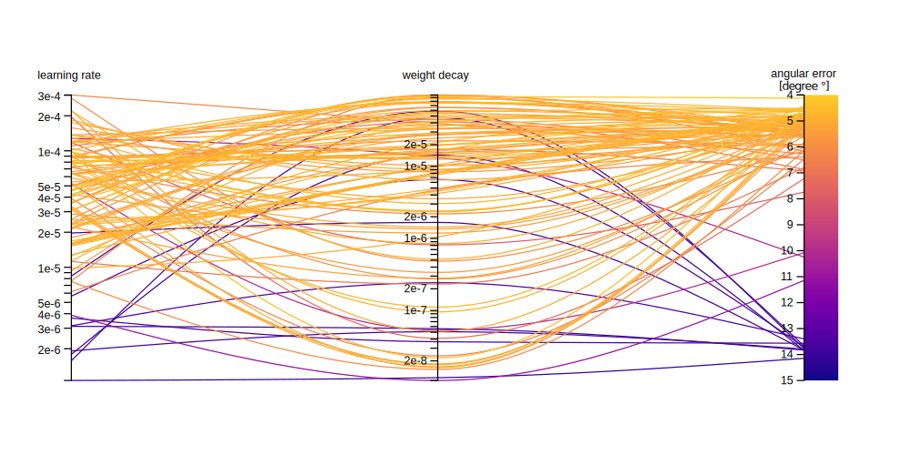
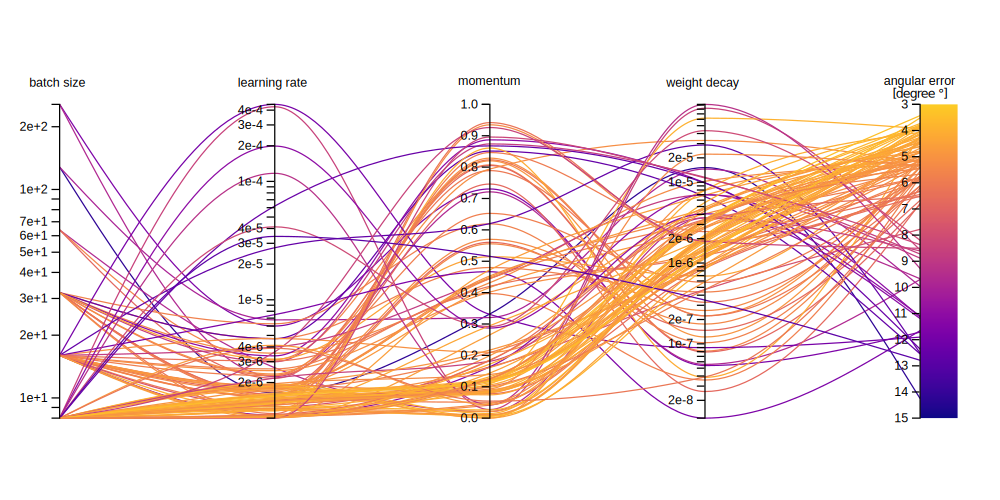

# SPatial Adaptive GaZe Estimator (SPAZE)

Implementation of the SPatial Adaptive GaZe Estimator (SPAZE) model proposed by [Lindén et al.](https://doi.org/10.1109/ICCVW.2019.00145). \
Even after conducting an extensive hyperparameter search, see the two figures below, their reported results cannot be reproduced.

# Setup
1. `pip install -r requirements.txt`
2. Download the original [MPIIFaceGaze](https://www.perceptualui.org/research/datasets/MPIIFaceGaze/) dataset and run `python dataset/mpii_face_gaze_preprocessed.py` or download the preprocessed data from [Google Drive](https://drive.google.com/file/d/1kIxJL88B1_op3oVlKonkMBbtj7t_DH-v/view?usp=sharing).
3. Start the training by running `python train.py` and watch the progress in TensorBoard via `tensorboard --logdir=./tb_logs`.

# Experiments

Lindén et al. stated that they used the adaptive moment estimation (Adam) Optimizer with a learning rate of 10^−3 and a weight decay of 10^−5 and trained to model for 30 epochs.
They did not state a batch size.

A hyperparameter search was performed, see figure below, to find the best learning rate, weight decay and batch size for the given model using the Adam Optimizer.
The leave-one-out training was performed with a learning rate of 5×10^−5, a weight decay of 10^−3 and with a batch size of 64, resulting in a mean angular error of 6.926 degrees over all 15 participants.

The same process was repeated with stochastic gradient descent (SGD) as the optimizer, see figure below, with an improvement, resulting in an accuracy of 5.144 degrees over all 15 participants.
The found hyperparameters result in an angular error of 3.429 degrees for person 0 with a batch size of 8, a learning rate of 1.038×10^−6, a momentum of 0.126 and a weight decay of 3.325×10^−5.

